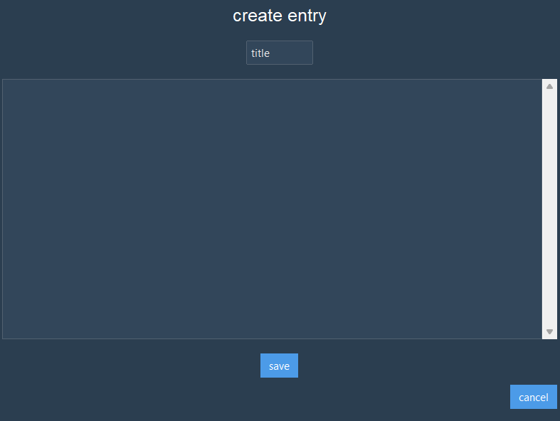
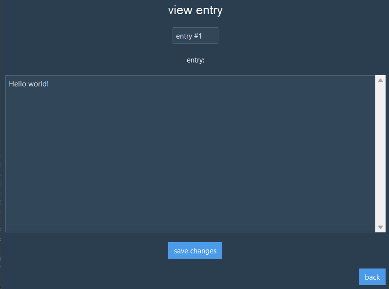
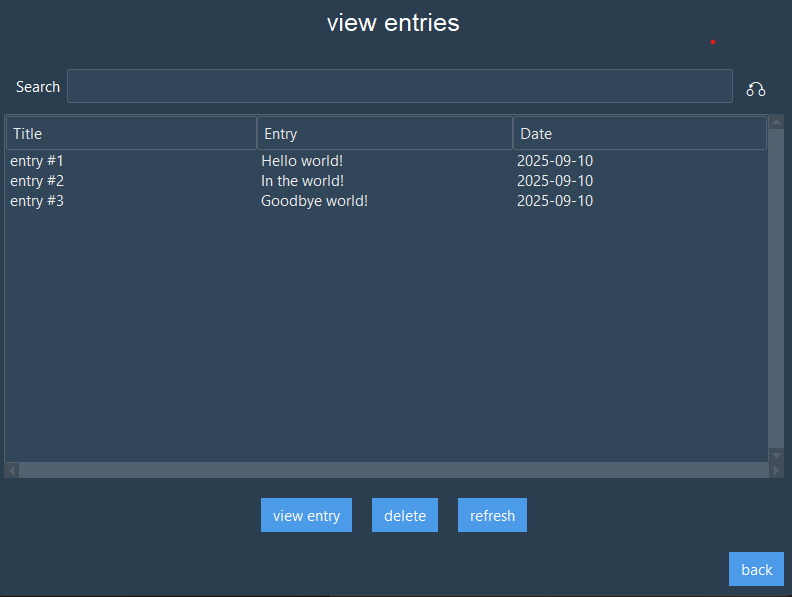

# noted. - Encrypted Notes App
A secure desktop notes app, built using Python (tkinter + SQLCipher)
Features include file encryption and CRUD note entries, with sleek UI design

## Features
- Encryption/decryption of database using user-specified key
- Create, view, edit and delete note entries
- Searchable entry table
- SQLCipher database for easy storage and lookup of entries
- Modern GUI built using Tkinter + ttkbootstrap

## Screenshots

Main menu:


Creating an entry:



Editing an entry:

>

Viewing entries:



## Installation
1. Clone the repository:
   
   ```bash
   git clone https://github.com/liamkitsingh/noted.git
   cd noted

2. Install dependencies:

   ```bash
   pip install ttkbootstrap sqlcipher3-wheels

3. Run the app:

   ```bash
   python main.py

## Usage
- On first run, set a decryption key to encrypt your database and store safely.
- On subsequent runs, enter the key to unlock your notes.
- Add, view, edit, or delete notes using the GUI.

## Security

- Full database encryption ensured via SQLCIPHER
- Decryption key never stored on file


